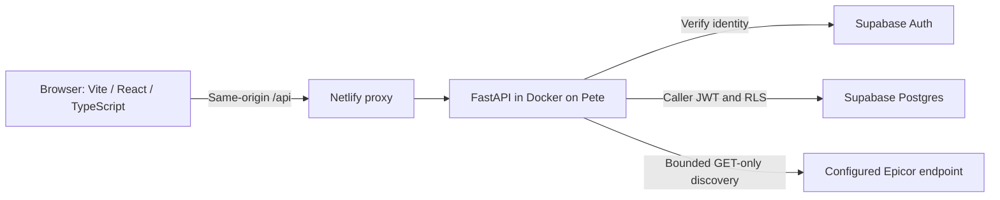

# Operis wiki

Operis provides an organization workspace and a growing discovery layer above existing business systems. This page is the starting point for using, developing and reviewing the repository.

[Open staging](https://operis-staging.netlify.app) · [Open discovery](https://operis-staging.netlify.app/discovery) · [Repository](https://github.com/Aim67TQ7/Operis) · [Discovery PR #3](https://github.com/Aim67TQ7/Operis/pull/3)

## Current status

**Last reviewed: September 8, 2026.** Staging deployment and merge acceptance are separate milestones.

| Area | State | What this means |
| --- | --- | --- |
| Organization foundation | PR #1 merged into `main` | Sign-in, organization/company/site setup, tenant isolation and audit history have recorded acceptance evidence. |
| Epicor browser discovery | Deployed to staging; PR #3 remains draft | Browser scanning and explicit assessment saving are implemented and tested with synthetic upstream responses. Real customer discovery and saved-assessment acceptance are still pending. |
| Public signup and commercial activation | Not implemented | An operator must provision organization membership for an existing verified account. Signing in alone does not grant access. |
| ERP write actions and scheduled automation | Not implemented | Discovery makes bounded read requests. A pilot request does not activate automation or authorize ERP changes. |

The owner confirmed on September 8 that the real Epicor scan, persisted assessment and matching audit entry have **not yet passed**; keep PR #3 draft. Its source can remain deployed to staging while those checks are completed. Publishing this wiki does not merge the discovery feature.

## Start using Operis

1. Open staging and sign in with your provisioned account. Use an existing password or request an email sign-in link. Open the newest link in the same browser/device that requested it; request a fresh link if it expires.
2. Select your organization. Only organizations where you have a current membership are shown. If the expected organization is absent, check the signed-in email and contact the administrator.
3. An administrator can open **Organization** to add companies and sites. For discovery, the company code must exactly match the intended Epicor company, including case.
4. Open **Activity** to inspect changes. Audit entries record the actor, operation, record, timestamp, before/after values and request correlation where available.
5. Sign out when finished. Sessions require reauthentication; Operis does not silently persist refresh tokens.

Account passwords use the shared identity provider. Changing an account password can affect other applications using that same identity. Enter passwords only in the application's intended credential form.

## Run Epicor discovery in the browser

This is the staging workflow supplied by draft PR #3. It requires an organization company record, a configured test connection, admin/operator access, and an existing Epicor account plus API key authorized for that company. An existing Kinetic browser login is not automatically reused.

1. Open **Discovery** and select the company.
2. Choose **Set up browser scan**. Confirm the displayed Epicor application endpoint. It is configured by the operator; the form does not accept arbitrary destinations.
3. Enter your Epicor username, password and API key in the form. Confirm the read-only aggregate collection and choose **Run read-only discovery**. No downloaded scanner or file upload is required.
4. Review the preview. Unavailable measurements are **unknown**; coverage does not establish ERP health, financial accuracy or savings.
5. Choose **Save assessment**. Reload, reopen the assessment from history, and check the matching **Activity** audit entry. Save is a separate action; merely running or cancelling a scan does not create an assessment.
6. Optionally choose **Request pilot review** on the saved assessment. This stores an audited request for an organization administrator. It sends no email, starts no ERP action and activates no subscription.

The preview expires after 30 minutes and is discarded on reload or company/organization change. Password and API-key inputs clear when a scan starts; credentials are used in request memory and are not retained by Operis. A failed save can be retried with the same unexpired receipt without duplicating the assessment. If the receipt expires, run a new scan.

### Collection scope

Discovery first verifies the selected company, then reads seven counts and four schema measurements: **twelve fixed GET requests** in total.

| Counts | Schema measurements |
| --- | --- |
| BAQs, BPM methods, function libraries, reports, dashboards, scheduled tasks and visible AP invoice records | AP invoices, vendors, purchasing and receipts: entity, field and custom-field totals |

The result is **company-wide**, not site-filtered. Choosing a site in Kinetic does not change the browser scan's scope. Raw definitions, invoice lines, financial amounts, credentials and raw HTTP responses are not retained. The saved record contains validated aggregates, computed findings/recommendations and audit evidence.

The scan uses verified HTTPS, no redirects, explicit destination/company configuration, bounded responses and a 22-second deadline for the Epicor read phase. Staging permits one scan at a time and three attempts per user per ten minutes. Cancelling discards the browser result; reads already started may finish within that deadline.

If your network requires local execution, the optional scanner kit remains available. Run it only under your organization's policy; download the kit and signed company configuration, execute locally, inspect the aggregate ZIP, then upload it. Do not change managed download restrictions to use this alternative. See the [complete discovery contract and receipts](https://github.com/Aim67TQ7/Operis/blob/build/discovery-assessment/docs/DISCOVERY.md).

## Access and architecture

| In-app action | Administrator | Operator | Viewer |
| --- | --- | --- | --- |
| Read organization structure and permitted assessments | Yes | Yes | Yes |
| Rename organization; create companies/sites | Yes | No | No |
| Run discovery, save assessments, request pilot review | Yes | Yes | No |
| Create organizations or grant memberships | Operator provisioning outside the app | Unavailable | Unavailable |

"Operator provisioning" is an administrative deployment procedure, distinct from the in-app Operator role. Users cannot grant themselves membership or a higher role.



Sessions use Secure, HttpOnly cookies. Browser code does not receive Supabase tokens or store them in JavaScript storage. FastAPI verifies current membership, and application data requests use the caller's JWT so database row-level security still applies. There is no runtime service-role key. Assessment persistence uses the existing narrow ingestion RPC with current membership/company checks and atomic audit.

The shared database and Auth configuration also serve other applications. Preserve unrelated schemas, users, policies, settings and infrastructure when making Operis changes. Credentials, customer endpoints, tenant identifiers and customer results do not belong in this public wiki or repository.

## Development and release workflow

The approved stack is Vite/React/TypeScript, Python/FastAPI, Supabase/Postgres, Netlify and Docker. Start with [README setup](https://github.com/Aim67TQ7/Operis#local-development) and [AGENTS.md](https://github.com/Aim67TQ7/Operis/blob/main/AGENTS.md). Dependency versions and hashes are committed in the lockfiles.

For frontend and database checks, run from the repository root:

```bash
npm run build
npm run test:web
npm run test:db
```

For API checks, run from `apps/api` after installing the locked environment:

```bash
uv run ruff check operis tests
uv run ruff format --check operis tests
uv run pytest -q
```

Open a PR for review. Record both automated checks and live acceptance evidence; keep synthetic tests distinct from real customer execution. Staging currently uses explicit deployments, so a merge does not by itself publish a new frontend or backend. Deploy only to the approved target with recorded source/release identifiers. Roll back application releases while retaining additive schema and audit history.

**Latest discovery evidence:** 125 API/scanner tests, 20 web tests and 26 PostgreSQL/PGlite tests passed, along with build and formatting. [CI for the verification commit](https://github.com/Aim67TQ7/Operis/actions/runs/34210878100) passed. Public proxy readiness/auth/Origin checks and the signed-in unconfigured-company rejection passed. These do not establish successful real Epicor authentication or a customer assessment save.

Before merging discovery, complete and record the real scan, preview, saved-assessment reload, matching audit entry and pilot-request acceptance described in the discovery evidence. Then recheck the current PR's CI and reviews and explicitly finalize it. Production backup/restore, commercial activation and broader operational controls remain separate gates.

## Troubleshooting

| Symptom | Next step |
| --- | --- |
| Expected organization is missing | Check the signed-in account and have the administrator verify current membership. |
| Browser discovery is not configured | Check the selected company code and ask the operator to configure that tenant/company's approved endpoint. |
| Epicor company check fails | Verify the company, username, password, API key and account permissions. No assessment was saved. |
| A measurement is unavailable | Treat it as unknown and review the stated permission/exposure/status gap. Do not interpret it as a zero count or healthy result. |
| Scan is busy or rate-limited | Allow the current scan or attempt window to finish before retrying. |
| Scan receipt changed or expired | Discard it and run a new scan. |
| Save fails after a preview | Retry the same receipt while it is valid. Check history if the outcome was unclear. |
| Sign-in link expired or session ended | Request a fresh link in the same browser or sign in again with your existing password. |

When reporting a problem, include the screen, approximate time, safe reproduction steps and displayed request reference. Do not include passwords, API keys, cookies or raw ERP responses.

## Source documents

| Document | Purpose |
| --- | --- |
| [Discovery](https://github.com/Aim67TQ7/Operis/blob/build/discovery-assessment/docs/DISCOVERY.md) | Current browser/local workflow, collection contract, deployment receipts and remaining live gates; on the draft discovery branch |
| [Verification](https://github.com/Aim67TQ7/Operis/blob/build/discovery-assessment/docs/VERIFICATION.md) | Dated foundation and discovery acceptance evidence |
| [Architecture decisions](https://github.com/Aim67TQ7/Operis/blob/build/discovery-assessment/docs/DECISIONS.md) | Append-only record of approved choices and superseded assumptions |
| [Setup](https://github.com/Aim67TQ7/Operis/blob/main/docs/SETUP.md) | Identity, environment and deployment configuration |
| [Pete deployment](https://github.com/Aim67TQ7/Operis/blob/main/docs/PETE.md) | Docker host and existing ingress configuration |
| [Build sequence](https://github.com/Aim67TQ7/Operis/blob/main/docs/roadmap/BUILD_SEQUENCE.md) | Foundation, deferred module work and later production gates |

Historical planning documents retain earlier status statements. Use dated verification receipts and the current PR state when deciding what has actually shipped or passed. Update this page after a release or acceptance decision; never turn a planned check into a passing receipt.
